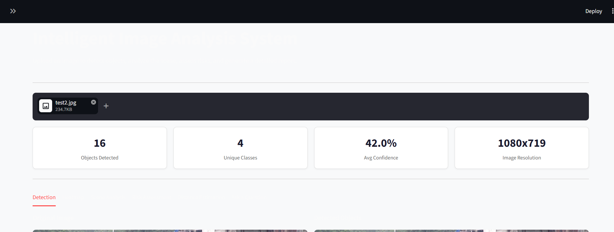
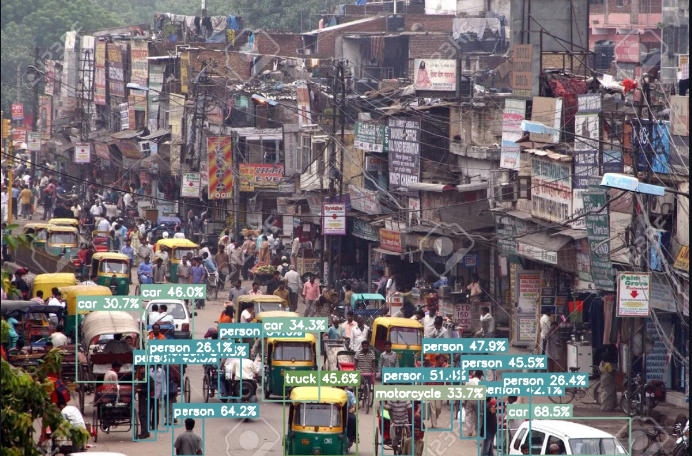
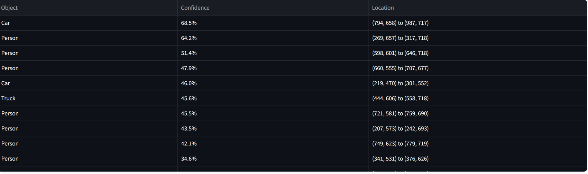
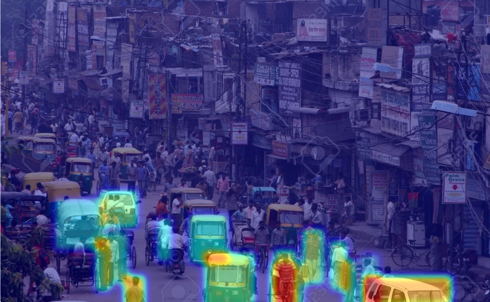

# 🔍 Intelligent Image Analysis System

An image analysis system that combines **YOLOv8** for real-time object detection with **Google Gemini** for intelligent scene understanding. Upload any image to get detailed object detection, scene description, safety risk assessment, distance estimation, and a downloadable PDF report.

---

## 📸 Screenshots

---

## ✨ Features

- **🎯 Object Detection** — Detects 80+ object classes using YOLOv8 Nano with adjustable confidence threshold
- **🌡️ Heatmap Visualization** — Overlays a density heatmap showing where objects are concentrated in the image
- **🧠 Scene Description** — Uses Google Gemini to generate a natural language description of the scene
- **⚠️ Safety Risk Assessment** — AI-powered safety analysis identifying risks and providing recommendations
- **📏 Distance Estimation** — Estimates relative distances between detected objects based on their positions
- **💬 Natural Language Querying** — Ask any question about the image and get a direct answer from Gemini
- **🔄 Image Comparison** — Upload two images to compare object detections and track changes between them
- **📄 PDF Report Export** — Download a structured report containing the full analysis

---

## ⚙️ How it works

Object detection and scene understanding are handled by two separate models working together:

1. YOLOv8 runs locally on the uploaded image and returns bounding boxes, class labels, and confidence scores for every detected object
2. The detection results are passed as context to Google Gemini along with the image itself
3. Gemini uses both the structured detection data and its own visual understanding to generate scene descriptions, risk assessments, and answers to user questions
4. Distance estimation is computed geometrically using the normalized center coordinates of each bounding box
5. The heatmap is generated by accumulating detection confidence scores across the image and applying Gaussian blur for smooth visualization

---

## 🛠️ Tech stack

| Tool | Purpose |
|---|---|
| YOLOv8 (Ultralytics) | Real-time object detection |
| Google Gemini API | Scene description, risk assessment, Q&A |
| OpenCV | Image processing and bounding box rendering |
| Streamlit | Web interface |
| ReportLab | PDF report generation |
| Pillow | Image loading and conversion |

---

## 📚 What I learned

- How to combine a local computer vision model with a cloud-based LLM to produce richer outputs than either model alone
- How bounding box coordinates can be used to estimate relative spatial relationships between objects
- How to build a confidence-weighted heatmap using OpenCV's Gaussian blur and colormap functions
- How to generate structured PDF reports programmatically using ReportLab
- The importance of caching model loading with `st.cache_resource` to avoid reloading on every interaction

---

## 👤 Author

**Dhruv Panwar**
B.Tech CSE, VIT Bhopal
[GitHub](https://github.com/Dhruv-Panwar042) · [LinkedIn](https://www.linkedin.com/in/dhruv-panwar-159b08289)